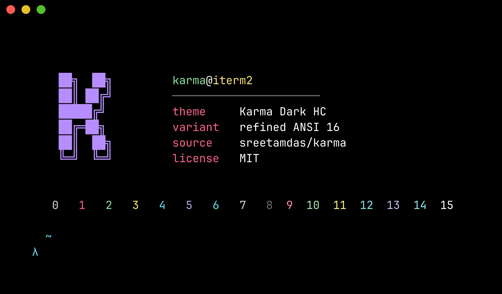
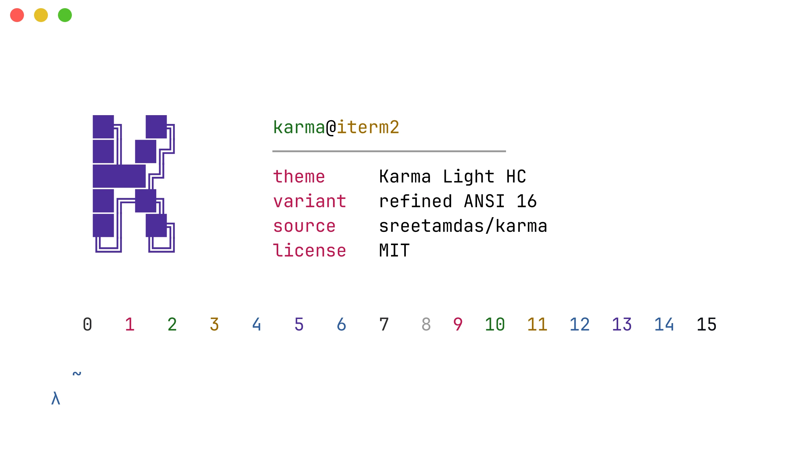
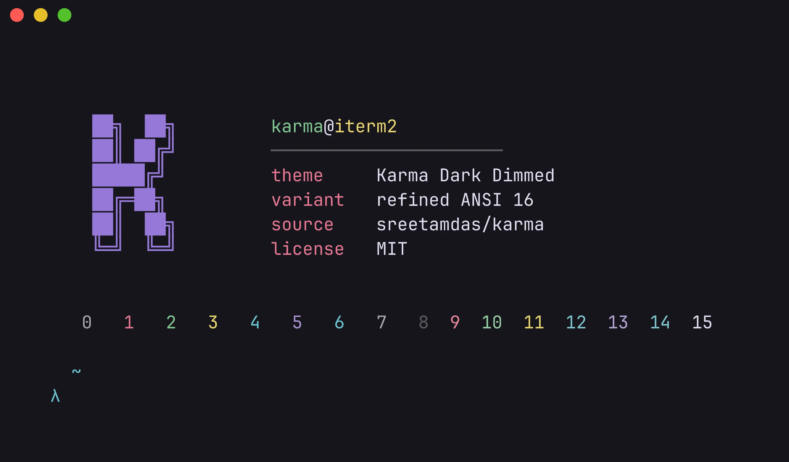
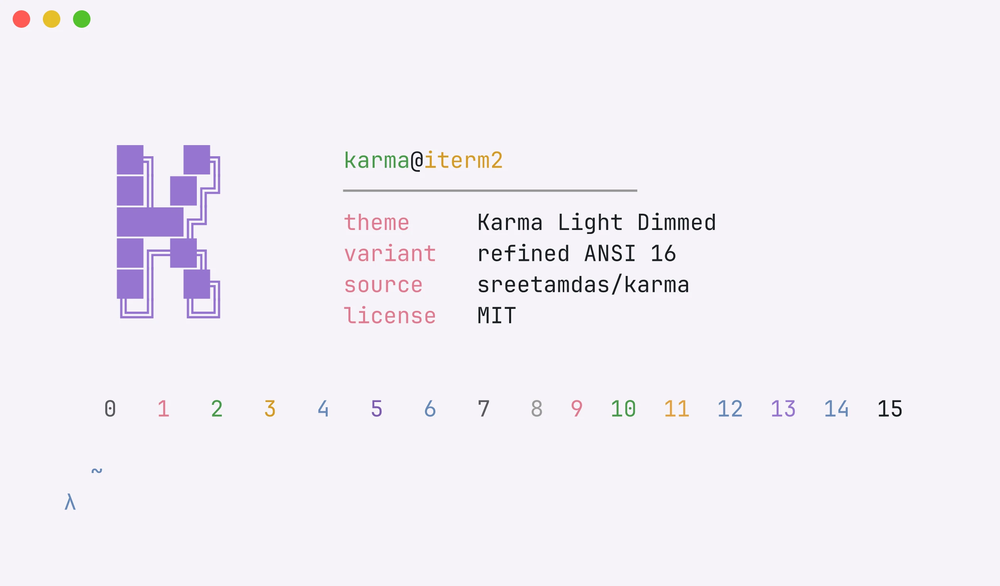
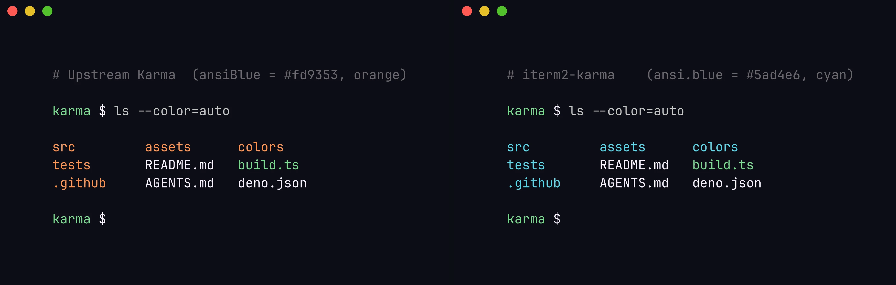

# iTerm2 Karma

[](https://github.com/aspatari/iterm2-karma/actions/workflows/ci.yml)
[](./LICENSE)

> [Karma](https://sreetamdas.com/karma) color theme by [Sreetam Das](https://github.com/sreetamdas) — ported to [iTerm2](https://iterm2.com).

Karma is a VS Code theme inspired by Ayu, Lucy, and Andromeda — vibrant accents on both dark and light backgrounds. This repository ports its palette into the `.itermcolors` format so your terminal matches your editor.

## Preview

<p align="center">
  
  <br>
  <em>🌙 Karma Dark</em>
</p>

<p align="center">
  
  <br>
  <em>☀️ Karma Light</em>
</p>

### Variants showcase

<table>
  <tr>
    <td align="center" width="50%">
      <br>
      <em>Karma Dark HC</em>
    </td>
    <td align="center" width="50%">
      <br>
      <em>Karma Light HC</em>
    </td>
  </tr>
  <tr>
    <td align="center" width="50%">
      <br>
      <em>Karma Dark Dimmed</em>
    </td>
    <td align="center" width="50%">
      <br>
      <em>Karma Light Dimmed</em>
    </td>
  </tr>
</table>

## Installation

Two ways, pick one:

### Option A — Drop-in Dynamic Profile (zero-click, recommended)

```bash
# Clone or download just the profiles you want, then:
mkdir -p ~/Library/Application\ Support/iTerm2/DynamicProfiles
cp profiles/karma-*.json ~/Library/Application\ Support/iTerm2/DynamicProfiles/
```

iTerm2 picks up the new profiles **immediately** — no restart, no clicks. All six variants appear in the **Profiles** menu (and in the iTerm2 ▶ Open ▶ … profile list). Each profile is identified by a stable Guid, so re-installing later updates the existing profile rather than duplicating it.

To switch: Profiles menu → choose the variant. Set one as default via Settings → Profiles → "Other Actions" → Set as Default.

To uninstall: just delete the JSON files from `~/Library/Application Support/iTerm2/DynamicProfiles/`. iTerm2 reverts to your previous setup.

### Option B — Color Preset import (the classic flow)

If you want to apply a Karma palette to an *existing* profile (keeping its font, behaviour, key bindings), use the `.itermcolors` color presets:

1. Download a variant from [`colors/`](./colors) — see the table below for guidance.
2. Launch iTerm2 and open Settings (`⌘ + ,`).
3. Go to **Profiles** → select the profile you want to edit.
4. On the **Colors** tab, click **Color Presets** → **Import…**.
5. Pick the `.itermcolors` file you downloaded.
6. Open **Color Presets** again and select the imported preset.
7. Done. ✨

You can also grab pre-built `.itermcolors` directly from the [latest GitHub Release](https://github.com/aspatari/iterm2-karma/releases/latest).

### Which to choose

| Goal | Use |
|------|-----|
| Switch entire profile (font, colors, behavior) with one click | **Dynamic Profile** (Option A) |
| Apply Karma colors to your already-configured profile | **Color Preset** (Option B) |
| Want all six variants visible at once in Profiles menu | **Dynamic Profile** (Option A) |
| Sync via dotfiles / install script / CI | **Dynamic Profile** (Option A — `cp` is scriptable) |
| Distribute via [iterm2colorschemes.com](https://iterm2colorschemes.com) lookup | **Color Preset** (Option B — that site indexes presets) |

## Variants

| Variant | File | When to use |
|---------|------|-------------|
| 🌙 Karma Dark | [`karma-dark.itermcolors`](./colors/karma-dark.itermcolors) | Default — Karma's signature dark theme |
| ☀️ Karma Light | [`karma-light.itermcolors`](./colors/karma-light.itermcolors) | Karma Light from VS Code — for bright environments |
| Karma Dark HC | [`karma-dark-hc.itermcolors`](./colors/karma-dark-hc.itermcolors) | High-contrast Dark — pure black background, amplified accents (outdoor / accessibility) |
| Karma Light HC | [`karma-light-hc.itermcolors`](./colors/karma-light-hc.itermcolors) | High-contrast Light — pure white background, deepened accents (projector / accessibility) |
| Karma Dark Dimmed | [`karma-dark-dimmed.itermcolors`](./colors/karma-dark-dimmed.itermcolors) | Dimmed Dark — softer accents, lifted background (OLED / late-night) |
| Karma Light Dimmed | [`karma-light-dimmed.itermcolors`](./colors/karma-light-dimmed.itermcolors) | Dimmed Light — off-white background, gentler accents (long reading sessions) |

All presets use the **refined ANSI 16 mapping** documented in the source comments of [`src/palette/dark.ts`](./src/palette/dark.ts) and [`src/palette/light.ts`](./src/palette/light.ts) — it sidesteps two quirks of Karma's verbatim `terminal.ansi*` ship values:

- **Dark:** `terminal.ansiBlue` and `ansiBrightBlue` are both set to orange in the upstream theme, which makes directories show as orange in `ls --color=auto`. The refined mapping uses Karma's cyan-blue instead.
- **Light:** `terminal.ansiBlack` is set to white (inverted ANSI 0/7 polarity), which breaks several CLI tools. The refined mapping uses dark for ANSI 0 and a mid-gray for ANSI 7.

#### Visual proof: directories in `ls --color=auto`

<p align="center">
  
</p>

Left side: upstream Karma — directories render as orange because `terminal.ansiBlue = #fd9353`. Right side: this port — directories render as cyan because `ansi.blue = #5ad4e6`. Same `ls --color=auto` invocation, same theme intent, no terminal config changes — just a different ANSI 4 mapping in the preset.

The HC and Dimmed variants are derived from the Dark/Light bases via TypeScript object-spread overrides — only the cells that differ are listed explicitly. See [`src/palette/dark-hc.ts`](./src/palette/dark-hc.ts) etc. for the exact deltas.

## Recommended font

Karma's screenshots use [Iosevka](https://typeof.net/Iosevka/) (`Iosevka Term` or `Iosevka`). For the closest match to the original theme, configure the same font in iTerm2. Any other monospace font works correctly — the palette does not depend on the font.

## Building from source

The presets are produced by a Deno build script from a single TypeScript palette source in `src/palette/`. End users **do not need** Deno — all six `.itermcolors` files are committed to the repository.

```bash
# Requires Deno >= 2.0
deno task build
```

The script generates files in `colors/` deterministically: a second run produces no changes (this is enforced in CI via `git diff --exit-code colors/`). Full pipeline:

```bash
deno task fmt:check    # formatting
deno task lint         # linting
deno task check        # type-check (strict mode)
deno task test         # unit tests
deno task build        # generate all 6 .itermcolors
```

### Architecture

A small Layered + Functional-Core / Imperative-Shell pipeline. Hex codes live in **exactly one place** (`src/palette/`); everything downstream is a pure transformation.

```
                 ┌─────────────────────────────────────┐
                 │  src/palette/  —  the only place    │
                 │  hex literals exist                 │
                 │                                     │
                 │  ├─ types.ts (Palette, AnsiColors)  │
                 │  ├─ dark.ts        ┐                │
                 │  ├─ light.ts       │  base         │
                 │  ├─ dark-hc.ts     ┤  +            │
                 │  ├─ light-hc.ts    │  spread       │
                 │  ├─ dark-dimmed.ts ┤  overrides    │
                 │  └─ light-dimmed.ts┘                │
                 └────────────┬────────────────────────┘
                              │ Palette objects
                              ▼
                 ┌─────────────────────────────────────┐
                 │  src/render/  —  pure transforms    │
                 │                                     │
                 │  ├─ color.ts          (hex→RGB)     │
                 │  ├─ itermcolors.ts    (→ XML plist) │
                 │  └─ preview-data.ts   (→ shell vars)│
                 └────────────┬────────────────────────┘
                              │ rendered strings
                              ▼
                 ┌─────────────────────────────────────┐
                 │  build.ts  —  the only file with I/O│
                 │  (Deno.writeTextFile, Deno.mkdir)   │
                 └────────────┬────────────────────────┘
                              │
                ┌─────────────┼──────────────────────┐
                ▼             ▼                      ▼
       colors/karma-*    assets/_preview-data.sh    (stdout logs)
       .itermcolors      (sourced by preview.sh)
       (×6)              (sourced by preview.sh)
                                  │
                                  ▼
                              freeze + cwebp
                                  │
                                  ▼
                            assets/karma-*.webp
```

**Determinism contract:** a second `deno task build` produces zero `git diff` (CI enforces). Top-level plist keys are lex-sorted, RGB components use `Number.toString()` (locale-independent), inner color dicts are alphabetically ordered. See [`AGENTS.md`](./AGENTS.md) for the full architectural invariants.

## Screenshots

Recipe for reproducing the preview screenshots: [`assets/SCREENSHOTS.md`](./assets/SCREENSHOTS.md). The pipeline is fully automated — `freeze` renders the colored ANSI output of `assets/preview.sh` into a PNG without any GUI capture.

## References

- [sreetamdas/karma](https://github.com/sreetamdas/karma) — the original VS Code theme (MIT)
- [sreetamdas.com/karma](https://sreetamdas.com/karma) — theme demo page with examples in multiple languages
- [catppuccin/iterm](https://github.com/catppuccin/iterm) — repository structure and build-pipeline inspiration
- [iTerm2-Color-Schemes](https://github.com/mbadolato/iTerm2-Color-Schemes) — archive of `.itermcolors` themes (used for format validation)

## Acknowledgements

Huge thanks to [Sreetam Das](https://github.com/sreetamdas) for the original Karma theme. This port translates his palette into the iTerm2 format — every color choice and aesthetic decision is his.

The repository structure and build pipeline are inspired by [catppuccin/iterm](https://github.com/catppuccin/iterm).

## Contributing

PRs welcome — see [`CONTRIBUTING.md`](./CONTRIBUTING.md) for development setup, project conventions, and the verification gates the CI enforces. Bug reports and feature requests have [issue templates](./.github/ISSUE_TEMPLATE/) ready to go.

## License

[MIT](./LICENSE) — compatible with the [original Karma project's license](https://github.com/sreetamdas/karma/blob/main/LICENSE.md).
